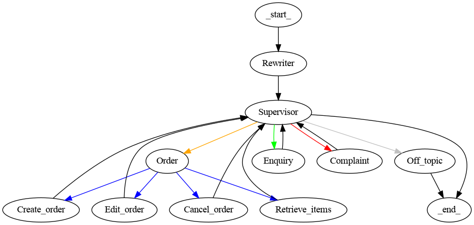

# 🧠 Agentic AI-Powered Support & Order Management System  

This project is an **agentic AI system** designed to automate **customer support, order management, and user enquiries** using a **multi-agent workflow**. It leverages **LangGraph**, **LangChain**, and **RAG (Retrieval-Augmented Generation)** to provide **intelligent, context-aware, and data-grounded responses**.  

---

## 🚀 Project Overview  

The system is a **graph-based multi-agent AI framework** that acts as a bridge between **natural language reasoning** and **structured database actions**.  

Key capabilities include:  
- Autonomous **order handling** (create, edit, cancel, retrieve).  
- Automated **support ticket management**.  
- Handling general **user enquiries**.  
- **Dynamic routing** via a supervisor/router agent.  
- **RAG-enabled knowledge retrieval** for data-grounded AI responses.  

This setup enables AI agents to **interact with structured databases** safely while providing **human-like, intelligent automation**.

---

## 🏗️ System Architecture  

The architecture is **modular and agentic**, combining multiple specialized agents into a single, orchestrated workflow. 



### 1. Graph-Based Multi-Agent Workflow (LangGraph)
- The workflow is represented as a **state graph**, where nodes are **agents or actions** and edges are **conditional routes**.  
- Allows dynamic decision-making based on user input or agent responses.  
- Makes it easy to **visualize and extend** the AI system.  

### 2. Order Handler Agent
- Handles all **order-related tasks**:  
  - **Create Order** – Initiates a new purchase.  
  - **Edit Order** – Updates existing orders (quantity, items, delivery).  
  - **Cancel Order** – Cancels active or pending orders.  
  - **Retrieve Order Items** – Lists items in a user’s order.  
- Ensures **transactional integrity** with the database.  

### 3. Ticket Management Agents
- Automates **customer support ticket workflows**:  
  - **Create Ticket** – Logs a new inquiry.  
  - **Edit Ticket** – Updates ticket details or status.  
  - **Cancel Ticket** – Removes resolved or obsolete tickets.  
- Uses **SQLAlchemy sessions and rollback mechanisms** for safe database operations.  

### 4. Supervisor / Router Agent
- Acts as the **central orchestrator** that routes queries to the appropriate sub-agent.  
- Handles **conditional logic** for multi-agent workflows.  
- Aggregates responses from sub-agents and maintains **workflow continuity**.  

### 5. Complaint Handling with Specialized Departments
- Complaints are assigned automatically to **specialized department agents** such as **Billing, Shipping, Product Support**, etc.  
- Each department agent resolves the issue and reports back to the Supervisor.  
- Ensures faster response times and accurate handling of complaints.  

### 6. Retrieval-Augmented Generation (RAG) Integration
- Agents can **access knowledge bases, FAQs, or external documents** before generating responses.  
- Ensures **contextually accurate and data-grounded answers**.  
- Enhances the AI system’s **decision-making capabilities**.  

---

## 🧩 Technology Stack  

| Category | Technology |
|----------|-----------|
| **Programming Language** | Python 3.10+ |
| **Graph & Agent Framework** | LangGraph, LangChain |
| **RAG & Knowledge Retrieval** | LangChain RAG tools |
| **Web Framework** | FastAPI |
| **ORM / Database** | SQLAlchemy, PostgreSQL |
| **Environment Management** | Virtualenv  |

---

## ⚙️ Key Features  

- ✅ **Multi-Agent AI:** Specialized agents for order handling, ticket management, and enquiries.  
- ✅ **Graph-Based Workflow:** Orchestrated via **LangGraph** for conditional routing.  
- ✅ **RAG Integration:** Knowledge retrieval for data-grounded, context-aware responses.  
- ✅ **Database Safety:** Transactions with rollback and session management.  
- ✅ **Extensible:** Easy to add new agents, tools, or nodes.  
- ✅ **Human-Readable Outputs:** Responses returned as dictionaries or JSON for API or chatbot integration.  

---

## ⚙️ Running the Application  

```bash
# Clone the repository
git clone https://github.com/guavacoderepo/Zionmart-agent-server.git
cd Zionmart-agent-server

# Activate environment
python -m venv venv
source venv/bin/activate

# Install dependencies
pip install -r requirements.txt

# Run the FastAPI server
uvicorn src.api.main:app --port 5000
```
---

## 🧪 Use Cases  

### 🛍️ E-commerce Chatbots
- Help users find orders, track purchases, and generate support tickets.  

### 🧑‍💻 Customer Support
- Automate helpdesk ticket creation, editing, and closure.  
- Reduce workload and improve response times.  

### 🧩 Agentic AI Systems
- Multi-agent orchestration with **supervisor routing**.  
- Enables AI reasoning over **structured data and RAG knowledge sources**.  

---

## 🌐 Future Enhancements  

- ✅ Advanced **order analytics and reporting** agents.  
- ✅ **Multi-agent collaboration** for support, sales, and analytics.  
- ✅ **Vector search and semantic retrieval** for product recommendations.  
- ✅ **Authentication and role-based access** for secure API usage.  

---

## 🧭 Conclusion  

This project is a **foundation for agentic AI systems**, bridging **LLM reasoning**, **structured database interactions**, and **knowledge-grounded decision-making**.  
It can serve as a backend for **AI-powered chatbots, customer support platforms, and multi-agent orchestration frameworks**.
